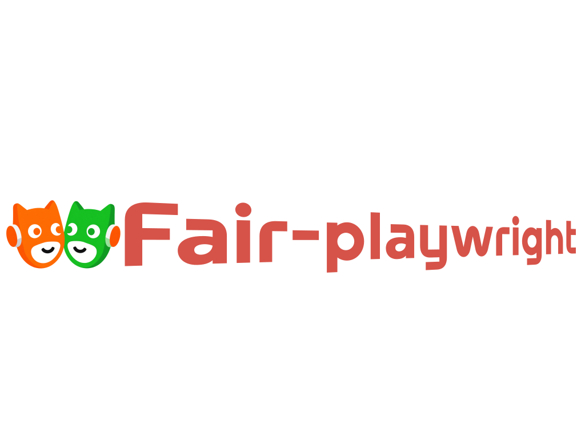

<div align="center">
  

  #

AI-optimized Playwright test reporter with progressive terminal output and hierarchical step management

  [](https://www.npmjs.com/package/fair-playwright)
  [](https://opensource.org/licenses/MIT)

</div>

## Features

- 🤖 **AI-First Design** - Structured output optimized for LLM context
- 📊 **MAJOR/MINOR Step Hierarchy** - Two-level test organization
- ⚡ **Progressive Terminal Output** - Live updates with smart compression
- 🎯 **Zero Config** - Works out of the box
- 🔌 **MCP Server** - Built-in AI assistant integration

## Installation

```bash
npm install -D fair-playwright
```

## Quick Start

### 1. Configure Playwright

```typescript
// playwright.config.ts
import { defineConfig } from '@playwright/test';

export default defineConfig({
  reporter: [['fair-playwright']]
});
```

### 2. Write Tests

```typescript
import { test } from '@playwright/test';
import { e2e } from 'fair-playwright';

test('user login', async ({ page }) => {
  await e2e.major('User login flow', {
    success: 'User logged in successfully',
    failure: 'Login failed',
    steps: [
      {
        title: 'Open login page',
        success: 'Page opened',
        action: async () => {
          await page.goto('/login');
        }
      },
      {
        title: 'Submit credentials',
        success: 'Form submitted',
        action: async () => {
          await page.getByLabel('Email').fill('user@example.com');
          await page.getByLabel('Password').fill('password');
          await page.getByRole('button', { name: 'Login' }).click();
        }
      }
    ]
  });
});
```

### 3. Run Tests

```bash
npx playwright test
```

## Documentation

📚 **Full Documentation**: https://baranaytass.github.io/fair-playwright/

- [Getting Started](https://baranaytass.github.io/fair-playwright/guide/getting-started)
- [API Reference](https://baranaytass.github.io/fair-playwright/api/)
- [Configuration](https://baranaytass.github.io/fair-playwright/guide/configuration)
- [MCP Integration](https://baranaytass.github.io/fair-playwright/guide/mcp)
- [Examples](https://baranaytass.github.io/fair-playwright/examples/)

## MCP Server

Fair-playwright includes a Model Context Protocol server for AI assistants:

```bash
npx fair-playwright-mcp --help
```

See [MCP Guide](https://baranaytass.github.io/fair-playwright/guide/mcp) for details.

## Examples

Check out the [examples](./examples) directory for complete working examples.

## Contributing

Contributions are welcome! Please see [CONTRIBUTING.md](./CONTRIBUTING.md).

## License

MIT © [Baran Aytas](https://github.com/baranaytass)

## Links

- [Documentation](https://baranaytass.github.io/fair-playwright/)
- [npm Package](https://www.npmjs.com/package/fair-playwright)
- [GitHub Issues](https://github.com/baranaytass/fair-playwright/issues)
